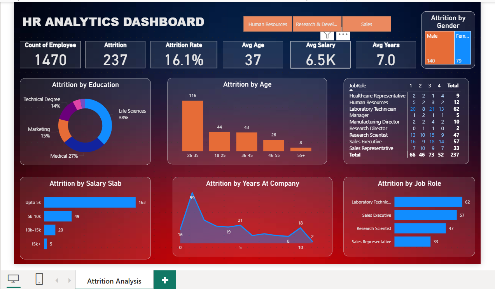

# 📊 HR Analytics Dashboard – Power BI Project

This project focuses on analyzing workforce data using Power BI to uncover actionable insights that support strategic HR decision-making, particularly in the areas of **employee retention**, **engagement**, and **diversity**.

---

## 🔍 Objective

To build an interactive HR analytics dashboard that provides a comprehensive view of workforce dynamics and helps HR professionals identify patterns, risks, and opportunities for improvement.

---

## 📌 Key Metrics Tracked

- **Total Employees:** 1,470  
- **Attrition Rate:** 16.09%  
- **Average Age:** 37 years  
- **Average Salary:** $6.5K  
- **Average Tenure:** 7 years  

---

## 📈 Key Insights

### 1. Age & Attrition
- Employees aged **26-35** represent the **highest attrition group**.
- Suggests a need for improved career pathing and engagement for early-career professionals.

### 2. Salary Analysis
- Employees earning **less than $5K** show **higher turnover** (163 exits).
- Indicates compensation is a major factor influencing retention.

### 3. Tenure & Onboarding
- Spike in attrition during the **first 1-2 years**.
- Calls for stronger onboarding, mentorship, and early engagement strategies.

### 4. Job Satisfaction
- Employees with **medium satisfaction** ratings have the **highest attrition rates**.
- Employee engagement programs could play a key role here.

### 5. Role & Department
- **Sales** and **R&D** departments face higher attrition.
- Customized retention strategies and support could help here.

### 6. Diversity & Inclusion
- Female employees aged **26-35** are leaving at a higher rate.
- Emphasizes the importance of flexible work policies and career development for women.

---

## 🛠️ Tools Used

- **Power BI**
- Data Modeling (Power Query, DAX)
- Interactive Dashboard Design

---

## 🌟 Outcomes

This dashboard helps HR leaders:
- Make **data-driven decisions**
- Enhance **employee retention**
- Improve **satisfaction and engagement**
- Identify at-risk groups before attrition spikes

---

## 🎓 Special Thanks

Big thanks to **Rishabh Mishra** for his *“Power BI Project End-to-End”* YouTube series, which greatly contributed to my learning journey!

---

## 📷 Dashboard Preview

---

## 📁 Files Included

- `.pbix` file
- Dataset (CSV/Excel)
- Screenshots of the dashboard
- Insight summary notes

---

## 🔗 Connect with Me

Feel free to connect or message me on [LinkedIn](https://linkedin.com/in/yourprofile) for feedback or collaboration!

---
